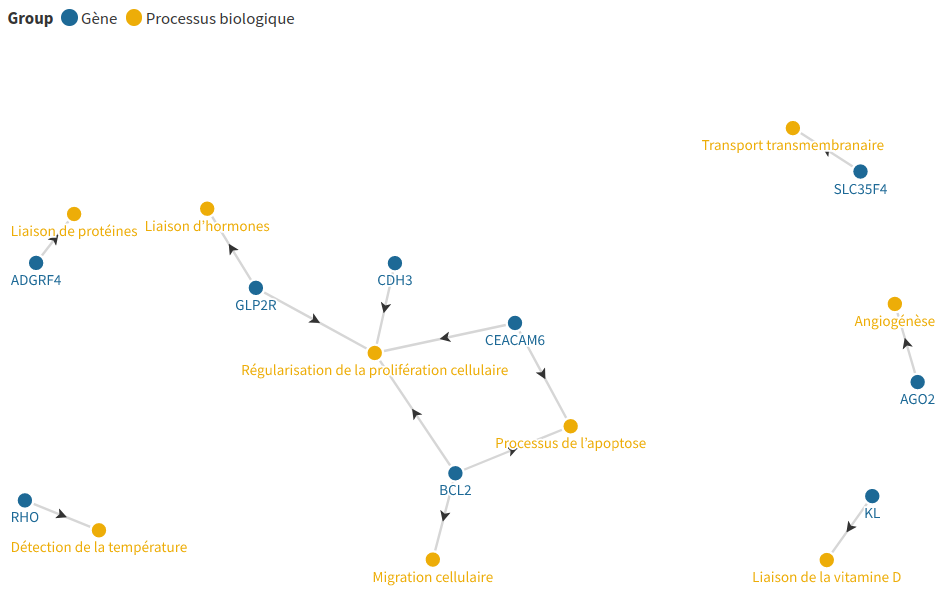

# MIMM 2023

## A bioinformatician in cancer research

### 1. Lien vers la première partie de l'atelier
Ici -> 

### 2. Partie débranchée. Travail manuel.

### 3. Création par ordinateur d'un graphe et manipulation de celui-ci.

Reproduisez le graphe de connaissances que vous voyez

Toujours sur le même graphe :
- Utilisez le site : https://www.genome.jp/kegg/
- Cherchez chacun des gènes du graphe
- Observez si il y a une annotation de “colorectal cancer” ou “gastric cancer”
  - Si oui, ajoutez un nouveau groupe de noeuds dans le graphe
  - Nommez le “KEGG” et ajoutez-y l’annotation “colorectal cancer”
  - Reliez tous les gènes qui doivent être connectés à cette annotation

- Supprimez les gènes et annotations qui sont isolés SI l’annotation n’est pas cohérente avec notre question
